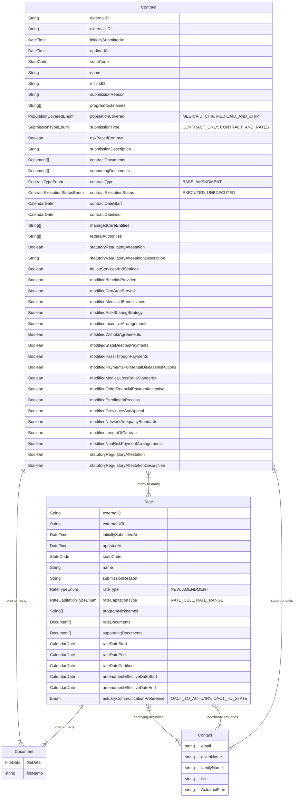

# Contract and Rate Without Revisions Design

This is an ER diagram of the data that is planned to be sent to Salesforce on submission. It relies on Salesforce's native diff tracking so elides the concept of Revisions. 

