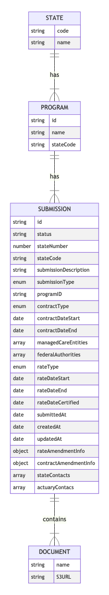

This diagram is drawn using [Mermaid](https://mermaid-js.github.io/mermaid/#/entityRelationshipDiagram). You can edit and save new diagrams using the [Mermaid Live Editor](https://mermaid-js.github.io/mermaid-live-editor).



**Source Code:**

```
erDiagram
STATE {
    string code
    string name
}STATE||--|{ PROGRAM : has

PROGRAM ||--|{ SUBMISSION : has
    PROGRAM {
        string id
        string name
        string stateCode
    }

SUBMISSION {
    string id
    string status
    number stateNumber
    string stateCode
    string submissionDescription
    enum submissionType
    string programID
    enum contractType
    date contractDateStart
    date contractDateEnd
    array managedCareEntities
    array federalAuthorities
    enum rateType
    date rateDateStart
    date rateDateEnd
    date rateDateCertified
    date submittedAt
    date createdAt
    date updatedAt
    object rateAmendmentInfo
    object contractAmendmentInfo
    array stateContacts
    array actuaryContacs
}


SUBMISSION ||--|{ DOCUMENT : contains
    DOCUMENT {
        string name
        string S3URL
    }
```
