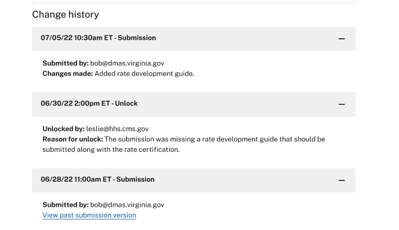

## Calculating contract and Rate Change History

## Overview
Change history is the feature of MC-Review where the application stores full copies of changes to submission data over time. The data is displayed to users on the submission summary page.

 

 This document details how the change history is calculated for contract and rate data and which database fields are used.
## Contraints
- MC-Review must track actions on contract or a rate (submit, unlock, resubmit) alongside the full form data present at that that momment in the database. This data is used for CMS reporting and audit purposes. It is considered part of the system of system.
- From a product requirement standpoint, MC-Review does not need to track changes on drafts (each edit a state makes to a draft data directly updates the original resource).

## Implementation
### The full copy of the submission data at a given point in time is called a revision. It is updated on submit.
The change history audit log is a list of revisions sorted by data. This is currently stored in the `revisions` field on the Contract and Rate tables.

A new revision is created each time a version of the form is submitted by states to CMS.

## The link between contract and rates is versioned as well. It is updated on submit.

It's possible to tell if a link has become outdated by refencing the `valid After` and `validUntil` fields on the join table between contract and rate revisions. The `validFrom` is set when a link is created (when a contract is submitted with a link to rates). At the point of creation, the `validUntil` is still null.

Later, if the related contract is then unlocked and resubmitted with the linked rate removed, the `validUntil` will be set. The revision link is still kept in the change history. But the link itself will be considered outdated since the `validUntil` is in the past.

*Dev Note* : If the `validUntil` is null we can assume the link between contract and rate is current.
### There is important metadata associated with a revision to track user actions. It is updated on submit and unlock.
The `unlockInfo` and `submitInfo` associated with that revision is important metadata. Specifically, only revisions that are unlocked or resubmitted have unlock info data.

*Dev Note*: If a submission has undefined `unlockInfo``, we can assume two things 1. that revision is the latest submitted version 2. that revision is the first submission associated with that contract or rate.

TODO
- [ ] add discussion `find*WithHistory`
- [ ] add discussion `draftRevision`

## Related documentation
- [Contract and Rates Refactor Relationships](./contract-rate-refactor-relationships.md).