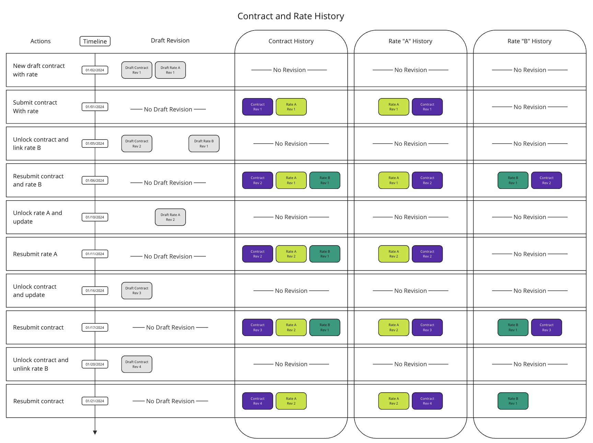
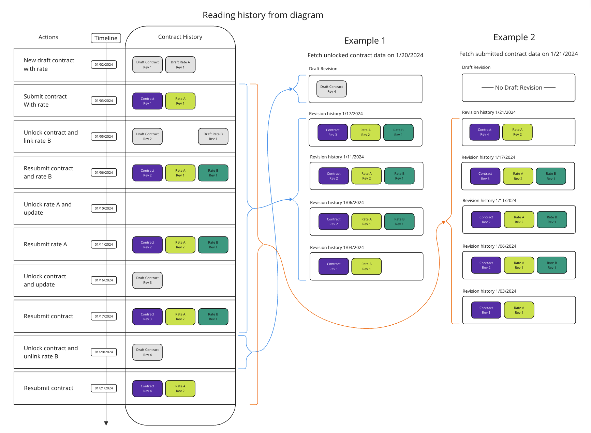

## Calculating Contract and Rate Change History

## Overview
Change history is the feature of MC-Review where the application stores full copies of changes to submission data over time. The data is displayed to users on the submission summary page.

 This document details how the change history is calculated for contract and rate data and which database fields are used.

## Diagram
[Miro link](https://miro.com/app/board/o9J_lS5oLDk=/?moveToWidget=3458764574794469060&cot=14)\

### Reading history
[Miro Link](https://miro.com/app/board/o9J_lS5oLDk=/?moveToWidget=3458764574799194467&cot=14)\

#### Example 1
In example 1, we are fetching the contract data on 1/20/2024 (pretend that proceeding actions have not occurred yet).
On this date, the contract has been unlocked and Rate B was removed from the contract.
When unlocking a contract or rate, a new draft revision is made. Any changes made to the contract or rate is reflected in these draft revisions.
Until the contract or rate is submitted, the draft revision will remain in the data when we fetch.
So when fetching on the unlocked contract on 1/20/2024 the data will return with a draft revision for the contract, then the revision history in reverse order.

#### Example 2
In example 2, we are fetching the contract on 1/21/2024 in a submitted state.
In this example there are no draft revisions, so the data returned is just the revision history.
You will notice that in at this date and time the contract, Contract Rev 4, that was in draft state on 1/20/2024 is no longer in draft state and now in the contract history column. When a contract or rate that is unlocked gets resubmitted its drafts are turned into a historical revision.

## Contraints
- MC-Review must track version history once a contract or rate is submitted.
    - This includes all actions on contract or a rate (submit, unlock, resubmit) alongside the related form data present at that point in time in the database.
    - This data is used for CMS reporting and audit purposes. It is considered part of the system of record.

## Implementation
### The full copy of the contract or rate  data at a given point in time is called a *revision*. A new revision is added on create or unlock. These are stored in a `revisions` field on the Contract or Rate.

The `revisions` field on the Contract and Rate tables is the most important part of our version history. The user can only ever change one revision at a time. Sorting of revisions is by `createdAt` - so the point in time when the revision was created by a state submit or a CMS unlock.

### Drafts are not part of the `revisions` field in the API

A draft revision is created during a create or unlock. Information about drafts is stored outside the `revisions` list in the domain models and the API.

At the Postgres Table level, draft revisions and submitted revisions live in the same table. In our domain models, the revision history only has submitted revisions and the (one max) draft revision if it exists is stored separately.

### The Contract or Rate and its associated change history is parsed into domain model types between the database and the API. See (`contractWithHistory` and `rateWithHistory`)

The list of revisions returned from prisma is run through [Zod](https://zod.dev/) to return [domain mode types](../../services/app-api/src/domain-models/contractAndRates). This is initiated by the `*WithHistory` database functions. See [parseContractWithHistory](../../services/app-api/src/postgres/contractAndRates/parseContractWithHistory.ts) and [parseRateWithHistory](../../services/app-api/src/postgres/contractAndRates/parseRateWithHistory.ts).

#### Contract History
- `parseContractWithHistory` takes our prisma contract data and parses into our domain `ContractType`. In `ContractType` the `revisions` is an array of **contract** **revisions**; this is the contract history.
- `revisions` differs from `draftRevision` in the `ContractType`. The `draftRevision` is a singular revision that is not submitted and this data has no historical significance until it is submitted. Most of the data in this revision can be updated.
- Each **contract revision** in `revisions` is submitted and retains data at the time of the submission. These revision's data will never be updated to retain its historical integrity.
- An important note about the `rateRevisions` field in each contract revision in `revision`.
   - Like contracts, rates also have **rate revisions** which are used to construct a rate history through submissions, but the purpose of `rateRevisions` on a contract revision is not for rate history.
   - The purpose of `rateRevisions` is to retain the data of a rate linked to this contract revision at the time of submission.
   - For that we need the single rate revision that was submitted at the time this contract revision was submitted.
   - Here are some guidelines for each rate revision in `rateRevisions` of a contract revision.
      - Each rate revision in `rateRevisions` is unique by rate id, meaning there will never be two rate revisions with the same rate id in `rateRevisions`
      - Each rate revision is the latest submitted up till the contract revision submitted time.
      - Like contract revision, rate revision is read only and cannot be updated to retain its historical integrity.

*Dev Note*: If the `draftRevision` field has a value and the `revisions` field is an empty array, we know the Contract or Rate we are looking at is an initial draft that has never been submitted.

### The link between contract and rates is versioned. That link is solidified on submit.

It's possible to tell if a link between a contract and rate has become outdated by refencing the `valid After` and `validUntil` fields on the join table between contract and rate revisions. The `validFrom` is set when a link is created (when a contract is submitted with a link to rates). At the point of creation, the `validUntil` is still null.

Later, if the related contract is then unlocked and resubmitted with the linked rate removed, the `validUntil` will be set. The revision link is still kept in the change history. But the link itself will be considered outdated since the `validUntil` is in the past.

*Dev Note*: If the `validUntil` is null we can assume the link between contract and rate is current.

### There is important metadata associated with a revision to track user actions. It is updated on submit and unlock.

The `unlockInfo` and `submitInfo` associated with that revision is important metadata. Specifically, only revisions that are unlocked or resubmitted have unlock info data.

*Dev Note*: If a submission has undefined `unlockInfo`, we can assume two things 1. that revision is the latest submitted version 2. that revision is the first submission associated with that contract or rate.

### When contract and rates are submitted in a package, rates are submitted first in the system.

When constructing a new package with a draft contract that has a draft rate, one of them must be submitted first. We have chosen that rates submit first, then contracts are submitted with a relationship to a set of submitted rates.

## Related documentation
- [Contract and Rates Refactor Relationships](./contract-rate-refactor-relationships.md).
