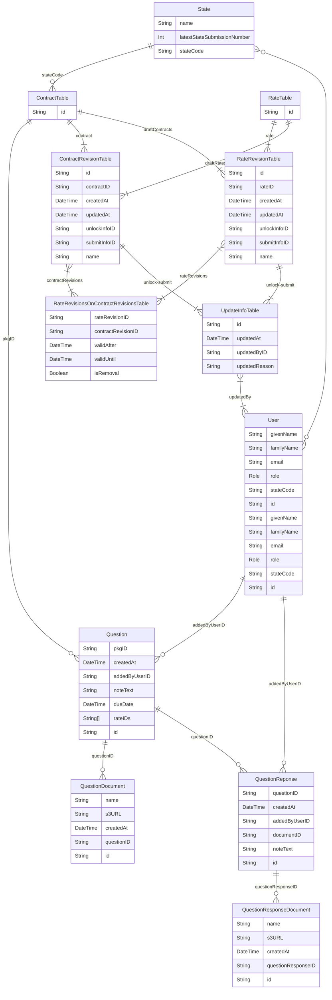

# Diagram of the database

```mermaid
erDiagram

State {
   String name
   Int latestStateSubmissionNumber
   String stateCode
}

Question {
   String pkgID
   DateTime createdAt
   String addedByUserID
   String noteText
   DateTime dueDate
   String[] rateIDs
   String id
}
QuestionDocument {
   String name
   String s3URL
   DateTime createdAt
   String questionID
   String id
}
User {
   String givenName
   String familyName
   String email
   Role role
   String stateCode
   String id
}

QuestionReponse {
    String questionID
    DateTime createdAt
    String addedByUserID
    String documentID
    String noteText
    String id
}

QuestionResponseDocument {
   String name
   String s3URL
   DateTime createdAt
   String questionResponseID
   String id
}

State ||--o{ ContractTable : stateCode
ContractTable ||--o{ Question : pkgID
User  ||--o{  Question : addedByUserID
User  ||--o{  QuestionReponse : addedByUserID
Question  ||--o{  QuestionDocument : questionID
Question ||--o{ QuestionReponse: questionID
QuestionReponse ||--o{ QuestionResponseDocument: questionResponseID
User  }o--o{  State : ""


ContractTable {
   String id
}
ContractRevisionTable {
   String id
   String contractID
   DateTime createdAt
   DateTime updatedAt

   String unlockInfoID
   String submitInfoID

   String name
}

RateTable {
   String id
}
RateRevisionTable {
   String id
   String rateID
   DateTime createdAt
   DateTime updatedAt

   String unlockInfoID
   String submitInfoID

   String name
}

RateRevisionsOnContractRevisionsTable {
   String rateRevisionID
   String contractRevisionID

   DateTime validAfter
   DateTime validUntil
   Boolean isRemoval
   
}

UpdateInfoTable {
   String id

   DateTime updatedAt
   String updatedByID
   String updatedReason
}

ContractTable ||--|{ ContractRevisionTable : contract
ContractTable ||--|{ RateRevisionTable: draftContracts
RateTable ||--|{ RateRevisionTable : rate
ContractRevisionTable }|--|{ RateRevisionsOnContractRevisionsTable : contractRevisions
RateTable ||--|{ ContractRevisionTable: draftRates
RateRevisionTable }|--|{ RateRevisionsOnContractRevisionsTable : rateRevisions


ContractRevisionTable ||--|{ UpdateInfoTable: unlock-submit
RateRevisionTable ||--|{ UpdateInfoTable: unlock-submit

UpdateInfoTable }|--|{ User: updatedBy

User {
   String givenName
   String familyName
   String email
   Role role
   String stateCode
   String id
}

```
