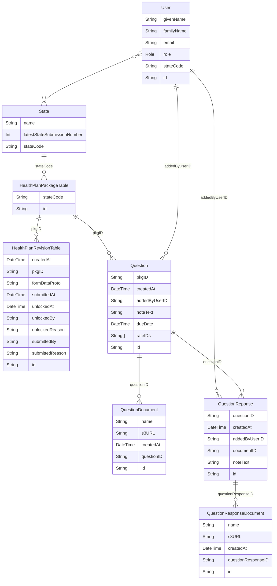

# Diagram of the database

```mermaid
erDiagram

State {
   String name
   Int latestStateSubmissionNumber
   String stateCode
}
HealthPlanPackageTable {
   String stateCode
   String id
}
HealthPlanRevisionTable {
   DateTime createdAt
   String pkgID
   String formDataProto
   DateTime submittedAt
   DateTime unlockedAt
   String unlockedBy
   String unlockedReason
   String submittedBy
   String submittedReason
   String id
}
Question {
   String pkgID
   DateTime createdAt
   String addedByUserID
   String noteText
   DateTime dueDate
   String[] rateIDs
   String id
}
QuestionDocument {
   String name
   String s3URL
   DateTime createdAt
   String questionID
   String id
}
User {
   String givenName
   String familyName
   String email
   Role role
   String stateCode
   String id
}

QuestionReponse {
    String questionID
    DateTime createdAt
    String addedByUserID
    String documentID
    String noteText
    String id
}

QuestionResponseDocument {
   String name
   String s3URL
   DateTime createdAt
   String questionResponseID
   String id
}

State ||--o{ HealthPlanPackageTable : stateCode
HealthPlanPackageTable ||--o{ HealthPlanRevisionTable : pkgID
HealthPlanPackageTable ||--o{ Question : pkgID
User  ||--o{  Question : addedByUserID
User  ||--o{  QuestionReponse : addedByUserID
Question  ||--o{  QuestionDocument : questionID
Question ||--o{ QuestionReponse: questionID
QuestionReponse ||--o{ QuestionResponseDocument: questionResponseID
User  }o--o{  State : ""
```
