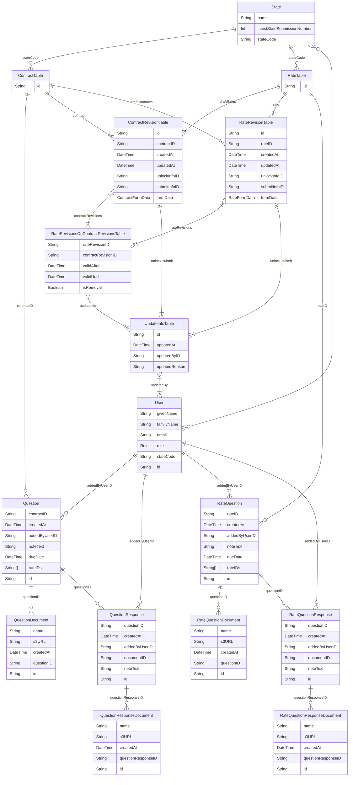

# Diagram of the database

```mermaid
erDiagram

State {
   String name
   Int latestStateSubmissionNumber
   String stateCode
}

User {
   String givenName
   String familyName
   String email
   Role role
   String stateCode
   String id
}

Question {
   String contractID
   DateTime createdAt
   String addedByUserID
   String noteText
   DateTime dueDate
   String[] rateIDs
   String id
}
QuestionDocument {
   String name
   String s3URL
   DateTime createdAt
   String questionID
   String id
}


RateQuestion {
   String rateID
   DateTime createdAt
   String addedByUserID
   String noteText
   DateTime dueDate
   String[] rateIDs
   String id
}
RateQuestionDocument {
   String name
   String s3URL
   DateTime createdAt
   String questionID
   String id
}

QuestionResponse {
    String questionID
    DateTime createdAt
    String addedByUserID
    String documentID
    String noteText
    String id
}

QuestionResponseDocument {
   String name
   String s3URL
   DateTime createdAt
   String questionResponseID
   String id
}

RateQuestionResponse {
    String questionID
    DateTime createdAt
    String addedByUserID
    String documentID
    String noteText
    String id
}

RateQuestionResponseDocument {
   String name
   String s3URL
   DateTime createdAt
   String questionResponseID
   String id
}

State ||--o{ ContractTable : stateCode
State ||--o{ RateTable : stateCode
ContractTable ||--o{ Question : contractID
User  ||--o{  Question : addedByUserID
User  ||--o{  QuestionResponse : addedByUserID
User  ||--o{  RateQuestion : addedByUserID
User  ||--o{  RateQuestionResponse : addedByUserID
Question  ||--o{  QuestionDocument : questionID
Question ||--o{ QuestionResponse: questionID
QuestionResponse ||--o{ QuestionResponseDocument: questionResponseID
RateQuestion  ||--o{  RateQuestionDocument : questionID
RateQuestion ||--o{ RateQuestionResponse: questionID
RateQuestionResponse ||--o{ RateQuestionResponseDocument: questionResponseID
User  }o--o{  State : ""


ContractTable {
   String id
}
ContractRevisionTable {
   String id
   String contractID
   DateTime createdAt
   DateTime updatedAt

   String unlockInfoID
   String submitInfoID

   ContractFormData formData
}

RateTable {
   String id
}
RateRevisionTable {
   String id
   String rateID
   DateTime createdAt
   DateTime updatedAt

   String unlockInfoID
   String submitInfoID

   RateFormData formData
}

RateRevisionsOnContractRevisionsTable {
   String rateRevisionID
   String contractRevisionID

   DateTime validAfter
   DateTime validUntil
   Boolean isRemoval
   
}

UpdateInfoTable {
   String id

   DateTime updatedAt
   String updatedByID
   String updatedReason
}

ContractTable ||--|{ ContractRevisionTable : contract
ContractTable ||--|{ RateRevisionTable: draftContracts
RateTable ||--|{ ContractRevisionTable: draftRates
RateTable ||--|{ RateRevisionTable : rate
ContractRevisionTable }|--|{ RateRevisionsOnContractRevisionsTable : contractRevisions
RateRevisionTable }|--|{ RateRevisionsOnContractRevisionsTable : rateRevisions
RateRevisionsOnContractRevisionsTable }|--|{ UpdateInfoTable: updateinfo
RateTable ||--o{ RateQuestion : rateID

ContractRevisionTable ||--|{ UpdateInfoTable: unlock-submit
RateRevisionTable ||--|{ UpdateInfoTable: unlock-submit

UpdateInfoTable }|--|{ User: updatedBy

```
