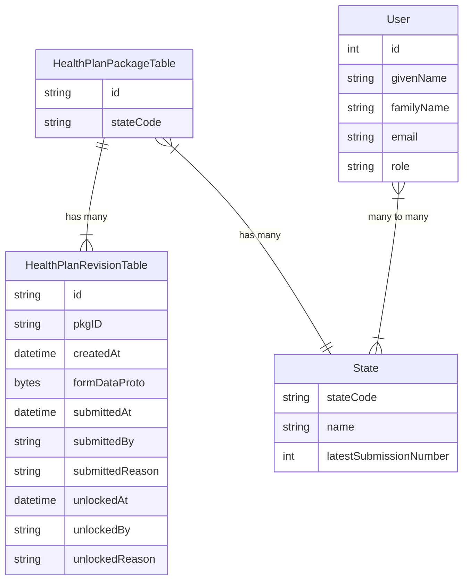
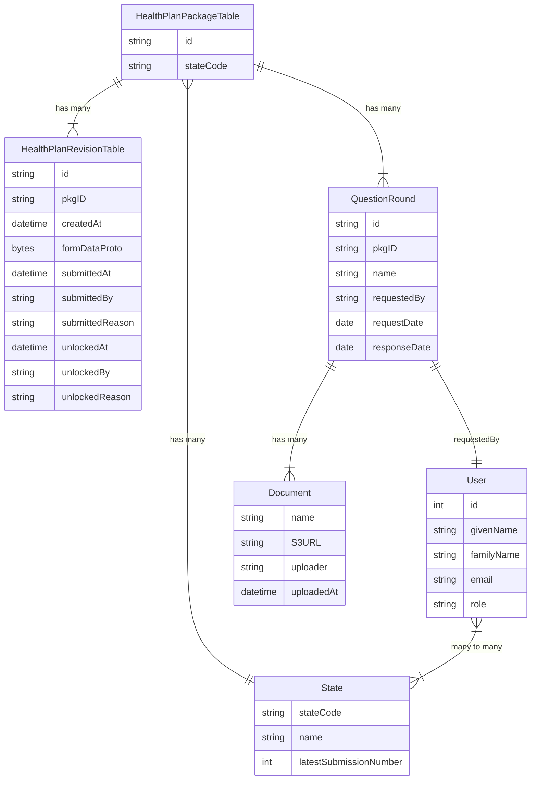

# Diagram of the db with future designs

## Current DB

```mermaid
erDiagram

HealthPlanPackageTable ||--|{ HealthPlanRevisionTable: "has many"
HealthPlanPackageTable }|--|| State: "has many"

HealthPlanPackageTable {
    string id
    string stateCode
}

HealthPlanRevisionTable {
    string id
    string pkgID
    datetime createdAt
    bytes   formDataProto
    datetime submittedAt
    string submittedBy
    string submittedReason
    datetime unlockedAt
    string unlockedBy
    string unlockedReason
}

State {
    string stateCode
    string name
    int latestSubmissionNumber
}

User {
    int id
    string givenName
    string familyName
    string email
    string role
}

User }|--|{ State: "many to many"
```

## QA Doc Upload Design

```mermaid

erDiagram

HealthPlanPackageTable ||--|{ HealthPlanRevisionTable: "has many"
HealthPlanPackageTable }|--|| State: "has many"

HealthPlanPackageTable {
    string id
    string stateCode
}

HealthPlanRevisionTable {
    string id
    string pkgID
    datetime createdAt
    bytes   formDataProto
    datetime submittedAt
    string submittedBy
    string submittedReason
    datetime unlockedAt
    string unlockedBy
    string unlockedReason
}

State {
    string stateCode
    string name
    int latestSubmissionNumber
}

User {
    int id
    string givenName
    string familyName
    string email
    string role
}

User }|--|{ State: "many to many"

QuestionRound {
    string id
    string pkgID
    string name
    string requestedBy  
    date requestDate
    date responseDate
}

QuestionRound ||--|| User: "requestedBy"            

QuestionRound ||--|{ Document: "has many"
HealthPlanPackageTable ||--|{ QuestionRound: "has many"

Document {
    string name
    string S3URL
    string uploader
    datetime uploadedAt
}

```
