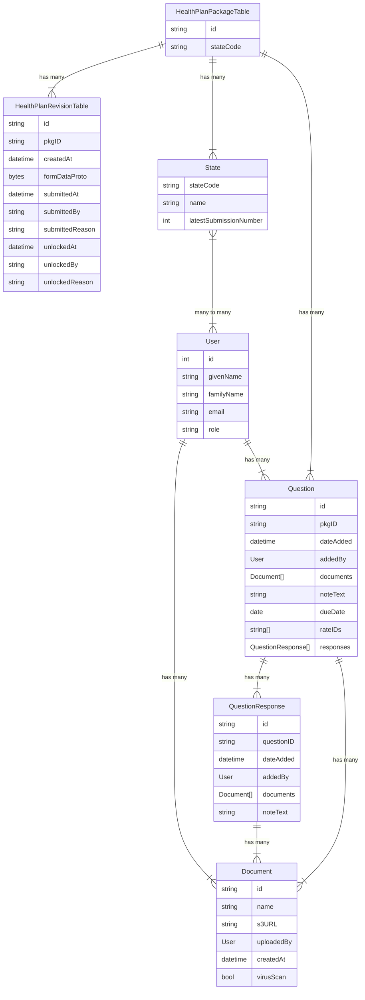

# Diagram of the database

```mermaid
erDiagram

HealthPlanPackageTable ||--|{ HealthPlanRevisionTable: "has many"
HealthPlanPackageTable ||--|{ State: "has many"
HealthPlanPackageTable ||--|{ Question: "has many"
State }|--|{ User: "many to many"

HealthPlanPackageTable {
    string id
    string stateCode
}

HealthPlanRevisionTable {
    string id
    string pkgID
    datetime createdAt
    bytes   formDataProto
    datetime submittedAt
    string submittedBy
    string submittedReason
    datetime unlockedAt
    string unlockedBy
    string unlockedReason
}

State {
    string stateCode
    string name
    int latestSubmissionNumber
}

User {
    int id
    string givenName
    string familyName
    string email
    string role
}

Document {
    string id
    string name
    string s3URL
    User uploadedBy
    datetime createdAt
    bool virusScan
}

User ||--|{ Document: "has many"

User ||--|{ Question: "has many"

Question ||--|{ QuestionResponse: "has many"

Question ||--|{ Document: "has many"

QuestionResponse ||--|{ Document: "has many"

Question {
    string id
    string pkgID
    datetime dateAdded
    User addedBy
    Document[] documents
    string noteText
    date dueDate
    string[] rateIDs
    QuestionResponse[] responses
}

QuestionResponse {
    string id
    string questionID
    datetime dateAdded
    User addedBy
    Document[] documents
    string noteText
}

```
