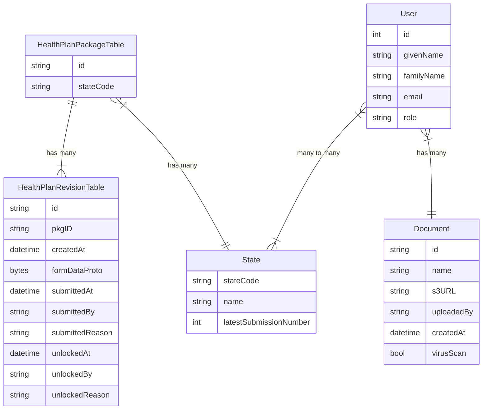

# Diagram of the database

```mermaid
erDiagram

HealthPlanPackageTable ||--|{ HealthPlanRevisionTable: "has many"
HealthPlanPackageTable }|--|| State: "has many"

HealthPlanPackageTable {
    string id
    string stateCode
}

HealthPlanRevisionTable {
    string id
    string pkgID
    datetime createdAt
    bytes   formDataProto
    datetime submittedAt
    string submittedBy
    string submittedReason
    datetime unlockedAt
    string unlockedBy
    string unlockedReason
}

State {
    string stateCode
    string name
    int latestSubmissionNumber
}

User {
    int id
    string givenName
    string familyName
    string email
    string role
}

Document {
    string id
    string name
    string s3URL
    string uploadedBy
    datetime createdAt
    bool virusScan
}

User }|--|| Document: "has many"

User }|--|{ State: "many to many"
```
