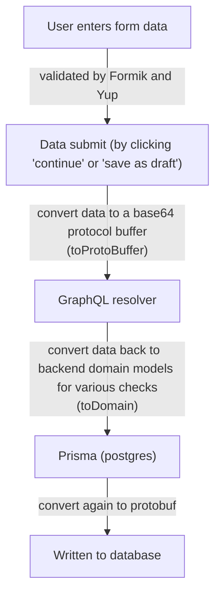
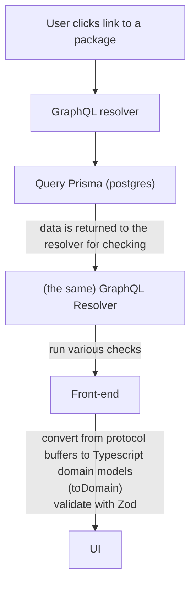

# Form-data flow

The MC-Review site's primary function is to collect form data from states, and package it for review by CMS. In this document, we'll describe the flow of that form data through the app; from creation to storage, and back from storage to the UI.

## Information entry

## Information retrieval

### Supplements

For an overview of what the data is like, and why it's being converted to and from protocol buffers, see [the serialization ADR](../architectural-decision-records/008-form-data-serialization.md).

For a more detailed look at what's happening in code when we ask for data, see the [discussion of GraphQL endpoints](creating-endpoints.md#graphql).
