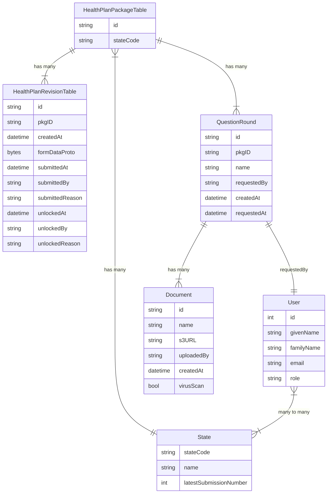
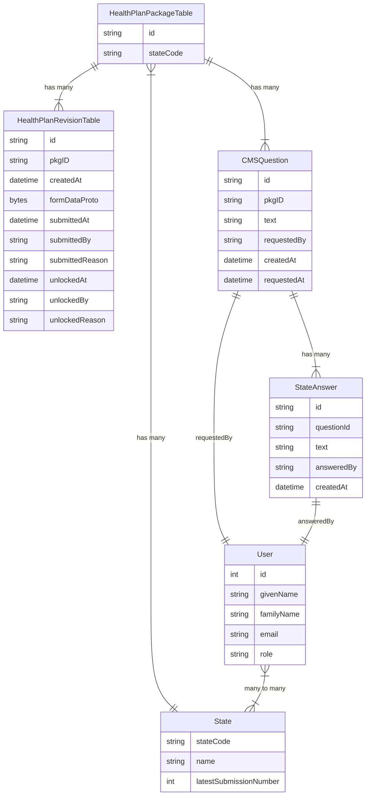

# Q&A Database Design Proposal

## Document Upload Design

```mermaid
erDiagram

HealthPlanPackageTable ||--|{ HealthPlanRevisionTable: "has many"
HealthPlanPackageTable }|--|| State: "has many"

HealthPlanPackageTable {
    string id
    string stateCode
}

HealthPlanRevisionTable {
    string id
    string pkgID
    datetime createdAt
    bytes   formDataProto
    datetime submittedAt
    string submittedBy
    string submittedReason
    datetime unlockedAt
    string unlockedBy
    string unlockedReason
}

State {
    string stateCode
    string name
    int latestSubmissionNumber
}

User {
    int id
    string givenName
    string familyName
    string email
    string role
}

User }|--|{ State: "many to many"

QuestionRound {
    string id
    string pkgID
    string name
    string requestedBy  
    datetime createdAt
    datetime requestedAt
}

QuestionRound ||--|| User: "requestedBy"            

QuestionRound ||--|{ Document: "has many"
HealthPlanPackageTable ||--|{ QuestionRound: "has many"

Document {
    string id
    string name
    string s3URL
    string uploadedBy
    datetime createdAt
    bool virusScan
}

```

## Single Questions Upload Design

```mermaid
erDiagram

HealthPlanPackageTable ||--|{ HealthPlanRevisionTable: "has many"
HealthPlanPackageTable }|--|| State: "has many"

HealthPlanPackageTable {
    string id
    string stateCode
}

HealthPlanRevisionTable {
    string id
    string pkgID
    datetime createdAt
    bytes   formDataProto
    datetime submittedAt
    string submittedBy
    string submittedReason
    datetime unlockedAt
    string unlockedBy
    string unlockedReason
}

State {
    string stateCode
    string name
    int latestSubmissionNumber
}

User {
    int id
    string givenName
    string familyName
    string email
    string role
}

User }|--|{ State: "many to many"

CMSQuestion {
    string id
    string pkgID
    string text
    string requestedBy  
    datetime createdAt
    datetime requestedAt
}

StateAnswer {
    string id
    string questionId
    string text
    string answeredBy
    datetime createdAt
}

CMSQuestion ||--|| User: "requestedBy"  
StateAnswer ||--|| User: "answeredBy"          

CMSQuestion ||--|{ StateAnswer: "has many"
HealthPlanPackageTable ||--|{ CMSQuestion: "has many"

```
