# Resolver design

## Background
Resolver functions are responsible for handling requests made to the MC-Review GraphQL API and populating data for the response on the backend. Between receiving the request data and returning a response, the `app-api` resolvers perform various tasks for generating the response.

These tasks include:
- Business logic, data transformation, and validations
- Database operations
- Third party API calls
   - SES Email
   - LaunchDarkly Feature Flags
- Error handling

The resolvers often do not directly contain the code to perform these tasks, instead they call functions specific for each task. Importantly we use types defined in our [domain models](design-patterns.md#domain-models) as the internal communication interface for different services as an attempt to decrease the coupling of our code.

Errors from these tasks propagate up to the resolver where it will be handled and a response sent to the client. See docs about [error handling](error-handling.md) for details.

## Diagram

```mermaid
---
title: Genric Resolver Design
---
flowchart TD
    subgraph request[GraphQL Request]
    end
    subgraph container[Flow]
      direction LR
      subgraph resolver[Resolver]
          subgraph errorHandling[Error Handling]
            featureFlags(Feature Flags)
            awsParameterStore(AWS Parameter Store Service)
            dataTransformation1(Data Transformation)
            postgresOperations(Postgres Database Operations)
            dataTransformation2(Data Transformation)
            emailNotification(Email Notifications)
          end
      end
      
      subgraph servicesAndFunctions[Services and Functions]
        ldService[Launch Darkly Service]
        awsParamService[Parameter Store Service]
        postHandlers[Postgres Handlers]
        emailerService[Emailer Service]
        hppToDomainType[HealthPlanPackageType to Domain Type]
        domainToHPPType[Domain Type to HealthPlanPackageType]
      end

      featureFlags -- Request Flags --> ldService
      ldService -- Feature Flag Values --> featureFlags
      ldService -- API Request --> launchDarkly[Launch Darkly]
      launchDarkly[Launch Darkly] -- API Response --> ldService

      awsParameterStore -- Request Param Store --> awsParamService
      awsParamService -- Param Store Values --> awsParameterStore
      awsParamService -- API Request --> awsParam[AWS Parameter Store]
      awsParam[AWS Parameter Store] -- API Response --> awsParamService

      dataTransformation1 -- Domain Model Type --> hppToDomainType
      hppToDomainType -- Domain Model Type --> dataTransformation1
      hppToDomainType -- Decode health plan form data --> protobuf1[Protobuf]
      protobuf1[Protobuf] -- HealthPlanPackageFormDataType --> hppToDomainType

      postgresOperations -- Domain Model Type --> postHandlers
      postHandlers -- Domain Model Type --> postgresOperations
      postHandlers -- Postgres Operation --> postgresDB[(Postgres DB)]
      postgresDB[(Postgres DB)] -- Prisma Model --> postHandlers

      dataTransformation2 -- Domain Model Type --> domainToHPPType
      domainToHPPType -- Domain Model Type --> dataTransformation2
      domainToHPPType -- Encode health plan form data --> protobuf2[Protobuf]
      protobuf2[Protobuf] -- HealthPlanPackageFormDataType --> domainToHPPType

      emailNotification -- Domain Model Type --> emailerService
      emailerService -- Void OR Error --> emailNotification
      emailerService -- API Request --> sesEmailer[AWS SES Email Service]
      sesEmailer[AWS SES Email Service] -- API Response --> emailerService
    end
    subgraph response[GraphQL Response]
    end
    
    request -- GraphQL Type --> container
    container -- GraphQL Type --> response

    style request stroke:#3498DB,stroke-width:4px
    style response stroke:#3498DB,stroke-width:4px
    style resolver stroke:#3498DB,stroke-width:4px,fill:#1f1f1f
```

## General Guidance
### Postgres Database Operations
[Postgres](https://www.postgresql.org/docs/) database operations are contained in functions that we call **postgres handlers**. You can find all the handlers in [`services/app-api/src/postgres/`](../../services/app-api/src/postgres). In these handler functions the database operations are performed using [Prisma ORM](https://www.prisma.io/docs/orm) which itself uses Prisma generated types and returns data from the database as these types. So in most of the handlers, data from the operation must be converted to a domain model type before returning to the resolver and errors occurring in the handler functions should be returned to the resolver to handle.

It's important that data from the DB is converted to the domain model before returning to the resolver to adhere to our strategy of using the domain model as the internal communication protocol for different parts of our app. 

Resolvers are passed Postgres handlers via [dependency injection](design-patterns.md#dependency-injection). The configuration for the Postgres handler dependency and many others are done in [apollo_gql.ts](../../services/app-api/src/handlers).

The diagram below is the data flow diagram for `createHealthPlanPackage` resolver.

```mermaid
---
title: createHealthPlanPackage Data Flow Diagram
---
flowchart RL
    subgraph resolver[Resolvers]
      subgraph createHealthPlanPackage[createHealthPlanPackage]
        callInsertContract[Insert Contract]
      end 
    end
    
    subgraph postgresHandlers[Postgres Handlers]
      subgraph insertContractHandler[insertDraftContract - Handler]
        prismaOrm[Prisma ORM]
        parseContractWithHistory[parseContractWithHistory]

        prismaOrm -- Prisma Model --> parseContractWithHistory
      end 
    end
    
    subgraph dbContainer[Database]
      postgresDB[(PostgresDB)]
    end

    callInsertContract -- Domain Model --> insertContractHandler
    parseContractWithHistory -- Domain Model OR Error --> callInsertContract

    prismaOrm -- Operation --> dbContainer
    dbContainer -- Data --> prismaOrm

    style resolver stroke-width:4px,fill:#1f1f1f;
    style postgresHandlers stroke-width:4px,fill:#1f1f1f;
```

Form the diagram above, you can see that `createHealthPlanPackage` resolver calls `insertDraftContract` Postgres handler function to create a new draft contract. Within the `insertDraftContract` after performing the database operation using Prisma we pass the Prisma model data into `parseContractWithHistory`, which is a function that coverts our Prisma model to domain model before returning data to the resolver.

### Data transformation
### Validations
### Protobuf
### Error handling

## Related Documentation
### Internal
- [Domain Models](design-patterns.md#domain-models)
- [Dependency Injection](design-patterns.md#dependency-injection)
- [Email Notifications](email-notifications.md)
- [Creating endpoints](creating-and-testing-endpoints.md)
- [Error Handling](error-handling.md)
### External
- [Postgres](https://www.postgresql.org/docs/)
- [Prisma ORM](https://www.prisma.io/docs/orm)
