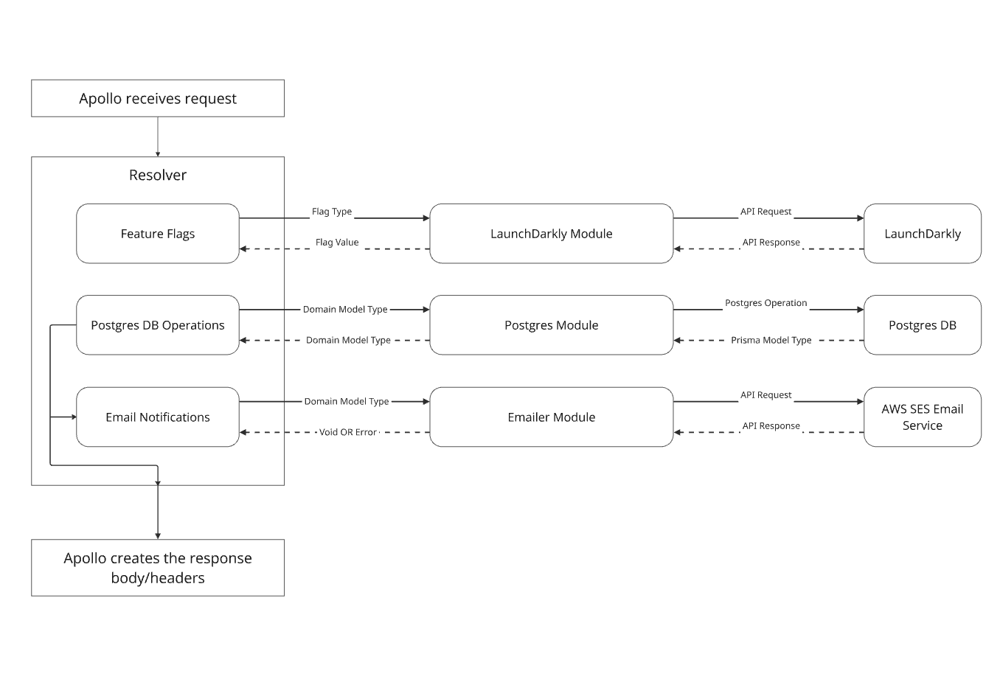
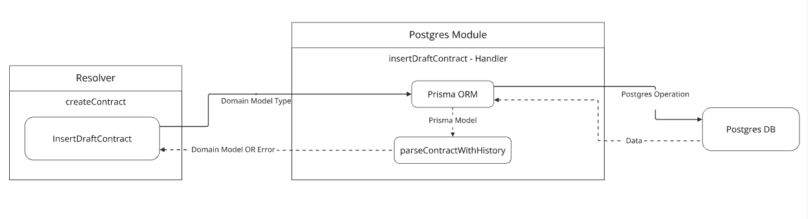

# Resolver design

## Background
Resolver functions are responsible for handling requests made to the MC-Review GraphQL API and populating data for the response on the backend. Between receiving the request data and returning a response, the `app-api` resolvers perform various tasks for generating the response.

These tasks include:
- Business logic, data transformation, and validations
- Database operations
- Third party API calls
   - SES Email
   - LaunchDarkly Feature Flags
- Error handling

The resolvers often do not directly contain the code to perform these tasks, instead they call functions specific for each task. Importantly we use types defined in our [domain models](design-patterns.md#domain-models) as the internal communication interface on the backend for different services as an attempt to decrease the coupling of our code.

Many of these functions are accessible from the resolver via [dependency injection](design-patterns.md#dependency-injection) and configured in [apollo_gql.ts](../../services/app-api/src/handlers). There are a few reasons to use dependency injection approach for the resolvers, but the two main points for the API are:
- Configuration of the dependencies for deployment environments.
- Configuration of the dependencies for unit tests. Configuration can be found in [gqlHelpers.ts](../../services/app-api/src/testHelpers/gqlHelpers.ts).

Errors from these functions propagate up to the resolver where it will be handled and a response sent to the client. See docs about [error handling](error-handling.md) for details.

### Diagram
[Miro link](https://miro.com/app/board/o9J_lS5oLDk=/?moveToWidget=3458764573512051070&cot=14)\

## General Guidance
### Postgres Module
[Postgres](https://www.postgresql.org/docs/) database operations are contained in functions that we call **postgres handlers**. You can find all the handlers in [`services/app-api/src/postgres/`](../../services/app-api/src/postgres). In these handler functions the database operations are performed using [Prisma ORM](https://www.prisma.io/docs/orm) which itself uses Prisma generated types and returns data from the database as these types. So in most of the handlers, data from the operation must be converted to a domain model type before returning to the resolver. Any errors occurring in the handler functions should be returned to the resolver to handle.

It's important that data from the DB is converted to the domain model before returning to the resolver to adhere to our strategy of using the domain model as the internal communication protocol for different parts of our app. 

Resolvers are passed Postgres handlers via [dependency injection](design-patterns.md#dependency-injection). The configuration for the Postgres handler dependency and many others are done in [apollo_gql.ts](../../services/app-api/src/handlers).

The diagram below is the data flow diagram for `createHealthPlanPackage` resolver.

[Miro link](https://miro.com/app/board/o9J_lS5oLDk=/?moveToWidget=3458764573517610448&cot=14)\

Form the diagram above, you can see that `createHealthPlanPackage` resolver calls `insertDraftContract` handler function in the Postgres Module to create a new draft contract. 

Notice the arrow coming from the resolver to the handler does not directly connect to the `Prisma ORM` this is because most handlers will do more data transformations and validations before passing them off to the `Prisma ORM` to perform the `Postgres` operation.

After performing the operation the `Postgres` data returned to `Prisma ORM` is passed into `parseContractWithHistory`, which is a function that coverts our Prisma model to domain model before returning data to the resolver.

Any errors that occurs in the handlers should be returned to the resolver to handle.

### Feature Flag Module
### Parameter Store Module
### Email Notifications Module
### Proto Module
### Validations
### Error handling

## Related Documentation
### Internal
- [Domain Models](design-patterns.md#domain-models)
- [Dependency Injection](design-patterns.md#dependency-injection)
- [Email Notifications](email-notifications.md)
- [Creating endpoints](creating-and-testing-endpoints.md)
- [Error Handling](error-handling.md)
### External
- [Postgres](https://www.postgresql.org/docs/)
- [Prisma ORM](https://www.prisma.io/docs/orm)
