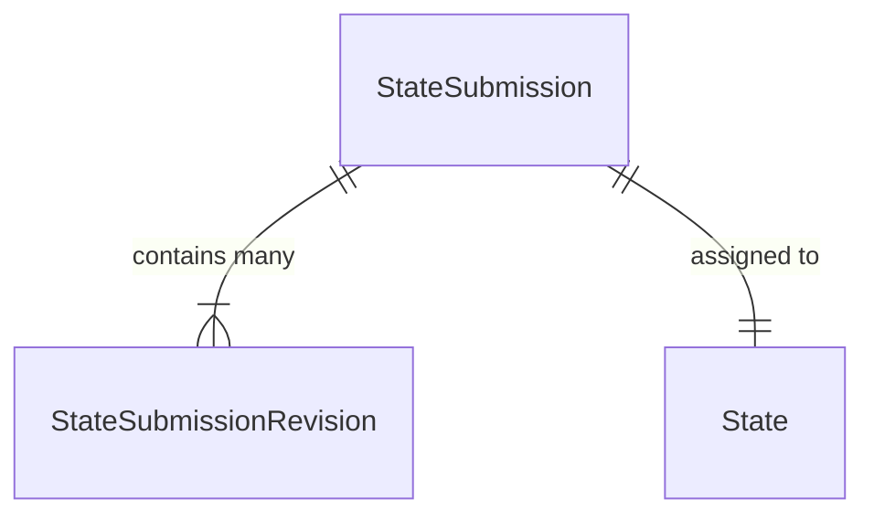
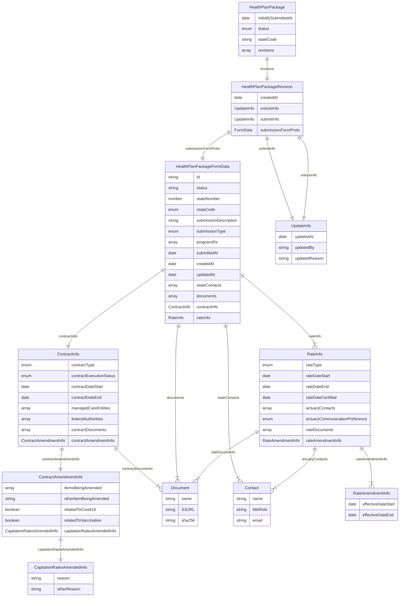

# Submission Data Model

Diagrams are drawn using [Mermaid](https://mermaid-js.github.io/mermaid/#/entityRelationshipDiagram) to better visualize the in the app. You can edit and save new diagrams using the [Mermaid Live Editor](https://mermaid-js.github.io/mermaid-live-editor).

## Database Models (birds-eye view)

For more detail, see [prisma schema](../services/app-api/prisma/schema.prisma).

## Domain Models (detailed representation of data and relationships)

For more detail, see [graphql schema](../services/app-graphql/src/schema.graphl) and the submission form data [proto schema](../services/app-proto/src/state_submission.proto)

Other notes:
- Programs are currently hardcoded in a [file](../services/app-api/data/statePrograms.json)
- "Health plan package" and "state submission" mean the same thing.
  

